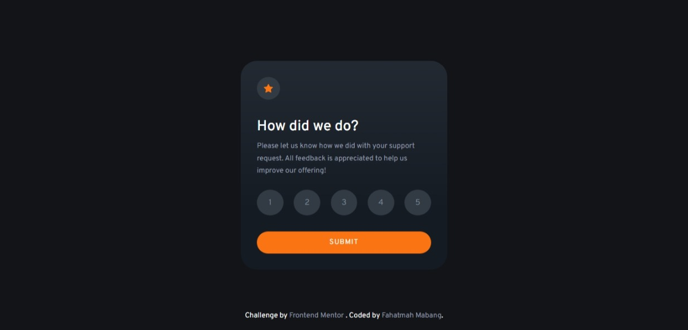

# Frontend Mentor - Interactive rating component solution

This is a solution to the [Interactive rating component challenge on Frontend Mentor](https://www.frontendmentor.io/challenges/interactive-rating-component-koxpeBUmI). Frontend Mentor challenges help you improve your coding skills by building realistic projects.

### The challenge

Users should be able to:

-  View the optimal layout for the app depending on their device's screen size
-  See hover states for all interactive elements on the page
-  Select and submit a number rating
-  See the "Thank you" card state after submitting a rating

### Screenshot

### Links

-  Live Site URL: [Interactive Rating Card](https://interactive-rating-component-main-frontend.netlify.app/)

### Built with

-  Semantic HTML5 markup
-  SCSS
-  Flexbox
-  Javascript

### What I learned

As a newbie in Web Development, it was overwhelming when I started to learn Javascript after HTML and CSS. And it was not easy, I always search and watch a lot of videos in Youtube or read in W3Schools. But I have learned basics of JS for now, and I eagerly want to learn more but my brain can not :D

I want to add more functions in the component but need to learn it first. And atleast for now, I met the requirements of this project.

## Author

-  Frontend Mentor - [@Fahatmah](https://www.frontendmentor.io/profile/Fahatmah)
